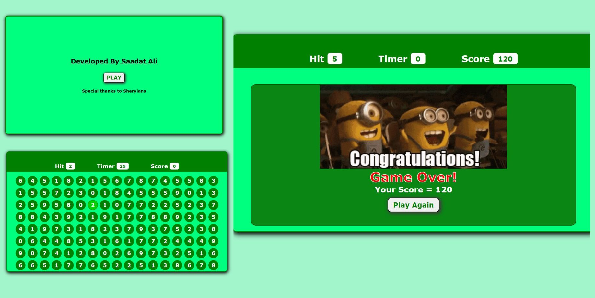

# Bubble-Game-Javascript

##Live Demo
Access the live version of the project: [Netlify Link](https://saadatbubblegame.netlify.app/)

This project is deployed and hosted on Netlify. Click the link above to explore the live version.

## Overview

This project is a Bubble game developed using JavaScript and SCSS. It is an interactive game where a menu appears at the start. When the user clicks "Play," the game starts with multiple bubbles on the screen. Each bubble has a unique hit number, and when the user hits the bubble with the given number, their score increases by 10. The total time for the game is 30 seconds, and at the end, the user can play again by clicking the "Play again" button.

## Technologies Used

- JavaScript: Used for game logic and interactivity.
- SCSS: Employed for styling the game elements and providing a visually appealing design.

## Getting Started

To play the Bubble game, follow these steps:

1. Clone the repository to your local machine or download the ZIP file.
2. Open the project folder in your preferred code editor.
3. Launch the index.html file in your web browser to start the game.

## Project Structure

The project is organized as follows:

bubble-game/  
|-- Index.html  
|---assets  
| |--img/  
| |-- css/  
| |--|-- styles.scss  
| |-- js/  
| |--|-- bubble.js  
|-- README.md  
  
- **index.html**: The HTML file contains the structure and content of the game.
- **css/styles.scss**: The SCSS file includes all the styles necessary to create an attractive layout and design.
- **js/game.js**: The JavaScript file contains the game logic and interactivity.

### Contributing

If you have any suggestions or improvements for the Bubble game, feel free to fork the repository, make your changes, and submit a pull request.

### License

This project is licensed under the MIT License.

## Contact

For any inquiries or feedback, please contact Saadat Ali at sadiraja500@gmail.com

Thank you for checking out the Bubble game project! We hope you enjoy playing the game and have a great time!
